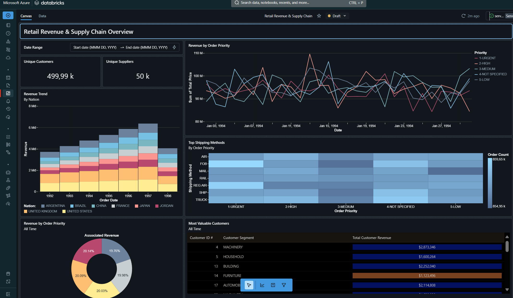
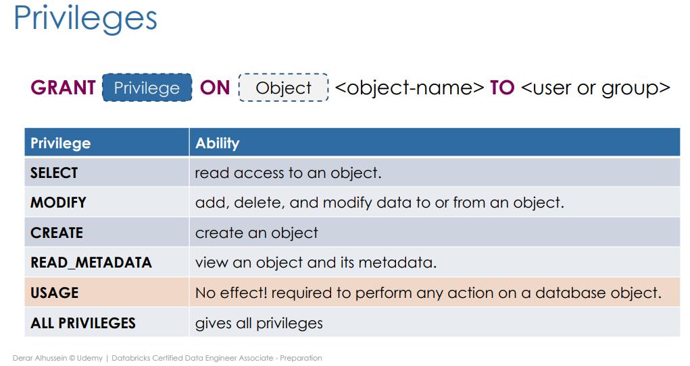

# Databricks Certified Data Engineer Associate
Preparation course for Databricks Data Engineer Associate certification exam with hands-on training
## I. Introduction
***What is databricks ?*** It's a lakehouse plateteform base on Apache Spark. Here is the architecture of databricks lakehouse:

<h3 align="center" class="heading-element" dir="auto">
<td><a target="_blank" rel="noopener noreferrer" href="https://www.databricks.com/en-website-assets/static/bc1b13843b6ac6cc8acf38eb5f28d09c/22595.png"></a></td>
<td><a target="_blank" rel="noopener noreferrer" href="https://www.databricks.com/en-website-assets/static/8d7550df77b7f3adc86525f1321535d5/22598.pngg"></a></td>
</h3>

***What is a lakehouse ?*** An unified plateform that combine benefits of datalake and data warehouse.


|| `DATALAKE`| `DATA WAREHOUSE` |
----------- |----------- | ----------- | 
| **`LAKEHOUSE`** | <li> Open </li> <li> Flexible </li> <li> ML support </li>  | <li> Reliable </li>  <li> Strong gouvernance </li> <li> Performance </li>| 

***How databricks ressources are deploy?*** 2 Layers :
| `Control plan` | `Data plane` |
----------- | ----------- | 
 |<li> Notebook </li> <li> Workflow </li> <li> Cluster managment </li> <li> Web UI </li>  | <li> Cluster VMs </li>  <li> DBFS </li>| 

 ### Cluster
 It's a set of computeur organized by driver and workers. Driver is the one who will orchestrate the jobs, transformation and storage amoung workers.
 In compute configuration in databricks, we can specify:
 * policy (choose unrestricted to create a free configurable cluster)
 * Access mode : sigle user, shared (only in Python and SQL) or no isolation shared (All languages)
 * number of node (worker)
 * Running time version + option using photon (a compute vector create in C++ to improve runtime performance)
 * Type of node
 * terminate time when the cluster is terminate automaticly 
 
### [Notebooks](https://github.com/DOX69/Databricks-Certified-Data-Engineer-Associate-Preparation/blob/main/1%20Databricks%20lakehouse%20plateform/1.1%20Notebook%20Basics.py)
It's the coding environment where we collaborate. 
Multiple language thanks to magic command %. We can also use %run to run an other notebook. We also have %fs to deal with file system operation. Ex : `%fs ls '/databricks-datasets'`

Other option to explore and interact with file (and more), we have `dbutils.help()` .A module provide various utilities. We prefere to use this because it can be a part of python code.

-------------------

## [II. Databricks lakehouse plateform](https://github.com/DOX69/Databricks-Certified-Data-Engineer-Associate-Preparation/tree/main/1%20Databricks%20lakehouse%20plateform)

### [Delta lake](https://github.com/DOX69/Databricks-Certified-Data-Engineer-Associate-Preparation/blob/main/1%20Databricks%20lakehouse%20plateform/1.2%20Understand%20delta%20lake.sql) [(And advance)](https://github.com/DOX69/Databricks-Certified-Data-Engineer-Associate-Preparation/blob/main/1%20Databricks%20lakehouse%20plateform/1.3%20Advanced%20Delta%20Lake%20Features.sql)
it's an open source storage framework that brings reliability to data lakes(data inconsistency and performance issues. Enabling build lakehouse. Perform ACID


We have **transaction log or delta log**. A single source of truth. To get the version, commit etc.
Advance featured : 
* Time travel : version > `VERSION AS OF` or table_name`@v`version_number or `TIMESTAMP AS OF` ; rollback > RESTORE TABLE table_name TO VERSION AS OF/TO TIMESTAMP AS OF
* Compaction : OPTIMIZE + ZORDER BY (data skipping)
<p align="center" >
 
</p>

* Vacuum : VACUUM table_name [retention period] . Definitly delete files older than a threshold (no time travel). Delfault is 7 days

### Relational entities
Database = schema in Hive metastore: `CREATE DATABASE|SCHEMA db_name` 
**Hive metastore** :repository of metadata that stores information for data structure, such as databases,tables and partitions,metadata, the format of the delta and where this data is actually stored in the underlying storage.

Depend on the location of the underline storage, we have 2 type table
| `Managed table` | `External table` |
----------- | ----------- | 
 |<li> Create in the storage under db directory of dbx </li> <li> Drop table drop the underline data </li>  | <li> underline data created outsite dbx</li>  <li> `CREATE TABLE table_name LOCATION 'path'` </li> <li> drop table will **NOT** drop underline data</li>| 

 ### [CTAS](https://github.com/DOX69/Databricks-Certified-Data-Engineer-Associate-Preparation/blob/main/1%20Databricks%20lakehouse%20plateform/1.4%20Databases%20and%20Tables%20on%20Databricks.sql)
```
CREATE TABLE table_new
COMMENT 'this is a comment'
PARTITION BY (city,birth_date) --for data skipping -- not usable for a small data
LOCATION '/some/path' -- if external
AS select * from table_from
```
### CONSTRAINTS
Constraints fall into two categories:
* Enforced contraints ensure that the quality and integrity of data added to a table is automatically verified.
  Specify with ALTER COLUMN to drop or add NOT NULL constraints
  ```
  ALTER TABLE people10m ALTER COLUMN middleName DROP NOT NULL;
  ALTER TABLE people10m ALTER COLUMN ssn SET NOT NULL;
  ```
  We can also add constraint, name it, with a condition, or drop it
  ```
  ALTER TABLE table_name ADD CONSTRAINT dateWithinRange CHECK (birthDate > '1900-01-01');
  ALTER TABLE table_name DROP CONSTRAINT dateWithinRange;
  ```

* Informational primary key and foreign key constraints encode relationships between fields in tables and are not enforced.
  ```
  CREATE TABLE T(pk1 INTEGER NOT NULL, pk2 INTEGER NOT NULL,
                CONSTRAINT t_pk PRIMARY KEY(pk1, pk2));
  CREATE TABLE S(pk INTEGER NOT NULL PRIMARY KEY,
                fk1 INTEGER, fk2 INTEGER,
                CONSTRAINT s_t_fk FOREIGN KEY(fk1, fk2) REFERENCES T);
  ``` 
  ### CLONE
  * **DEEP CLONE** `CREATE TABLE table_cloned DEEP CLONE source_table` during cloning syncronize changes from the target to the source,and copy all data, can take a while
  * **SHALLOW CLONE** only clone transaction log and don't infer changed, **not data moving during shallow clone**
 
  ### [View](https://github.com/DOX69/Databricks-Certified-Data-Engineer-Associate-Preparation/blob/main/1%20Databricks%20lakehouse%20plateform/1.5A%20Views.sql)
  Not the data but just a query
  * (Stored) VIEW
  * TEMP VIEW : persiste during [spark session](https://github.com/DOX69/Databricks-Certified-Data-Engineer-Associate-Preparation/blob/main/1%20Databricks%20lakehouse%20plateform/1.5B%20Views%20(Session%202).sql)
    > When as spark session is created in DBX ? Opening a new note book, attaching or detaching a cluster to a notebook, install package, restart cluster
  * GLOBAL VIEW : cluster scope view. You need to specify **global_temp** `SELECT * FROM global_temp.view_name`
    <p align="center" >
     
    </p>
  

## [III. ETL with Spark SQL and Python](https://github.com/DOX69/Databricks-Certified-Data-Engineer-Associate-Preparation/tree/main/2%20ETL%20with%20Spark%20SQL%20and%20Python)
### [Query files](https://github.com/DOX69/Databricks-Certified-Data-Engineer-Associate-Preparation/blob/main/2%20ETL%20with%20Spark%20SQL%20and%20Python/2.1%20Querying%20Files.sql) 

```
SELECT * FROM file_format.`some/path`
--Can be JSON, TXT, CSV , TSV, parquet
```

 ✌️Challenges : we want to query files (using Spark SQL) and **manualy define our schema** and create **delta table** . To overcome this,
* CT USNG OPTION LOCATION (CT UOLO) to define schema
* And We have CTAS that can create a delta table
  
=> we combine this with view so we have the benefits of each solutions

1) CT UOLO to define schema

**One solution  for manual declaration schema*** : CT USING OPTIONS LOCATION (external table) =>**Non-Delta table** + ***no data moving because external** BUT we can manualy declare schema
```
CREATE TABLE table_name
USING source_format
OPTIONS (key1 = val1, key2 = val2, ...)
LOCATION = path
```
<p align="center" class="heading-element" dir="auto">
<td> CSV example : </td>
<td> JDBC example :</td>
</p>
 
***Table with external data source is NOT a delta table*** 

2) Use CTAS statement to **create a (managed) delta table** 

```
CREATE TABLE table_name AS
SELECT * FROM file_format.`some/path`
```

**Limitation** : do not support file options;  CTAS do not support manual schema declaration


**==>> Combine solutions with view** is to combine the two previous technique and use temp view

```
CREATE TEMP TABLE temp_view_name (col_name1 col_type1, ... )
USING source_format
OPTIONS (key2 = val1, key2 = val2 ...) ;

--we've created a temporary view. Now let's use it to create a delta table using CTAS

CREATE TABLE table_name
AS SELECT * FROM temp_view_name ;

```

### [Write, overwrite and insert table](https://github.com/DOX69/Databricks-Certified-Data-Engineer-Associate-Preparation/blob/main/2%20ETL%20with%20Spark%20SQL%20and%20Python/2.2%20Writing%20to%20Tables.sql)
* `CREATE OR REPLACE TABLE` 
* `INSERT OVERWRITE` : unlike the first, INSERT OVERWRITE can only be perform on an existing table and only if match the current schema 
* `INSERT INTO` : Append data but you can insert the same records
* `MERGE INTO` : WHEN MATCHED, WHEN NOT MATCHED, UPDATE SET + additional conditions 

### [Advanced transformations](https://github.com/DOX69/Databricks-Certified-Data-Engineer-Associate-Preparation/blob/main/2%20ETL%20with%20Spark%20SQL%20and%20Python/2.3%20Advanced%20Transformations.sql)
1) Colon syntax to travel nested data structure 
 `key:sub value:value`
2) `from_json()`
function to create a JSON format field. Adding an option `schema_of_json()`. This create a struct tipe and we can use period **'.'**
3) `explode()` to explore an array. That allows us to put each element of an array on its own row.
4) `Collect_set()` aggregation : collect unique value for a field
5) `flatten()`[["B08"],["B09","B10"],["B08","B10"]] => ["B08","B09","B10","B08","B10"]
6) `array_distinct()` ["B08","B09","B10","B08","B10"] => ["B08","B09","B10"]
7) INTERSECTION/MINUS set operation return colomn found in both query
```
SELECT * FROM orders 
INTERSECT 
SELECT * FROM orders_updates 
```
8) PIVOT
   `PIVOT ( [agg_function]() FOR subclause in ()`
   Example (i.e. in the notebook associated)
   ```
   WITH cust_book_qtt AS(
   SELECT
    customer_id,
    book.book_id AS book_id,
    book.quantity AS quantity
   FROM orders_enriched
   where customer_id='C00004' )
   
   SELECT * FROM cust_book_qtt
   PIVOT (
   sum(quantity) FOR book_id in (
    'B01', 'B02', 'B03', 'B04', 'B05', 'B06',
    'B07', 'B08', 'B09', 'B10', 'B11', 'B12'
   )
   );
   ``` 
### [Higher Order functions](https://github.com/DOX69/Databricks-Certified-Data-Engineer-Associate-Preparation/blob/main/2%20ETL%20with%20Spark%20SQL%20and%20Python/2.4%20Higher%20Order%20Functions%20and%20SQL%20UDFs.sql)
Allow to work directly in an array object
* FILTER
Filter an array using a given lambda function

`FILTER(array_colomn,i -> i.array_colomn.column_name_in_array {+conditions}`

* TRANSFORM
  Apply a transformation on all items and extract the transformed value.
  
  Ex :
  we have 
  [{"book_id":"B09","quantity":2,"subtotal":48}]
  ```
  TRANSFORM (
    books,
    b -> CAST(b.subtotal * 0.8 AS INT)
  )
  ```
  we get
  [38]

### [SQL User Defined Functions UDFs](https://github.com/DOX69/Databricks-Certified-Data-Engineer-Associate-Preparation/blob/main/2%20ETL%20with%20Spark%20SQL%20and%20Python/2.4%20Higher%20Order%20Functions%20and%20SQL%20UDFs.sql)
  UDF functions leverage spark SQL directly maintaining all the optimization of Spark when applying logic to large datasets
  ```
  CREATE OR REPLACE FUNCTION function_name(optinal_parameter TYPE)
  RETURNS type_to_be_return
  RETURN some_logic ;

  --EX :
  CREATE OR REPLACE FUNCTION get_url(email STRING)
  RETURNS STRING
  RETURN concat("https://www.", split(email, "@")[1])

  -- NOTE: split() devide the string into multilple part according a given separator. And we take the second part of the email
  ```
Ex : `rgoodier7m@skype.com` =>  `https://www.skype.com`

## [IV. Incremental Data Processing](https://github.com/DOX69/Databricks-Certified-Data-Engineer-Associate/tree/main/3%20Incremental%20Data%20Processing)

### [Structured Streaming](https://github.com/DOX69/Databricks-Certified-Data-Engineer-Associate/blob/main/3%20Incremental%20Data%20Processing/3.1%20Structured%20Streaming.py)
It's any data source that grows over time from a new landing files in cloud storage, a database captured in a Change Data Capture (CDC) or events queued in pub/sub messaging feed like kafka

2 Approaches for processing :
* Reprocess all teh dataset eache time
* add last update >> Spark Structured Streaming : automaticaly identify new data
  A new row append to a table, that can be triggerd every min for ex
  <p align="center">
   
   </p>

   **Trigger Intervals** `.trigger({options})` ,which is 500ms by default
<p align="center">
   
   </p>

   **OutputMode** 
   * OutputMode("Append"), to append only new rows
   * OutputMode(""complete", recalculated results each time a write is triggered, so the
     target table is overwritten with each batch.

   **option("CheckpointLocation","/path"** Databricks creates checkpoints by storing the current state of
   streaming job to cloud storage

   One checkpoint for one stream

   **Unsupported Operations**:
   * Sorting operations
   * Deduplications

   **Advanced methods**
   * windowing
   * watermarking

### [Incremental data ingestion](https://github.com/DOX69/Databricks-Certified-Data-Engineer-Associate/blob/main/3%20Incremental%20Data%20Processing/3.2%20Auto%20Loader.py)
Ability data from new file since ast ingestion. Process only new file

2 options mechanisms : 
1) COPY INTO
* Thousands of files
* less efficiant at scale
  
2) [Auto loader](https://github.com/DOX69/Databricks-Certified-Data-Engineer-Associate/blob/main/3%20Incremental%20Data%20Processing/3.2%20Auto%20Loader.py) : Structured Streaming + checkpointing + fault tolerance
   
 => `readStream` & `writeStream`

* Millions of files
* Micro batches so efficient at scale
  
  It's infer automaticaly schema but we can specify a schema from a location.
  **Auto loader is recommend and best practice**
  

 ### [Milti-hop Architecture or medallion Architecture](https://github.com/DOX69/Databricks-Certified-Data-Engineer-Associate/blob/main/3%20Incremental%20Data%20Processing/3.3%20Multi-Hop%20Architecture.py)
<p align = "center">
 
</p>

***Improve structure and quality of data as it flow to each layer***

 Benefits :
 * Simple data model
 * Enables incremental ETL
 * Combine strean and batch workloads in unified pipeline
 * Recreate data from raw data at any time

## [V. Production Pipelines](https://github.com/DOX69/Databricks-Certified-Data-Engineer-Associate/tree/main/4%20Production%20Pipelines)

### [Delta Live Tables](https://github.com/DOX69/Databricks-Certified-Data-Engineer-Associate/blob/main/4%20Production%20Pipelines/4.1%20Delta%20Live%20Tables.sql)
[For creating data processing pipeline](https://learn.microsoft.com/fr-fr/azure/databricks/delta-live-tables/tutorial-pipelines)
`CREATE OR REFRESH STREAMING LIVE TABLE table_name AS SELET * FROM cloud_files()`

Pipeline mode :
* Triggerd : run once until the next manual or schedule update
* Continious : keep running until and ingesting data as it arrive

A new cluster will be created for the new DLT pipeline. Here the [cluster mode](https://learn.microsoft.com/fr-fr/azure/databricks/delta-live-tables/auto-scaling) :
* Fixed size (if 0 => single node cluster)
* Enhance autoscaling
* Legacy autoscaling

<p align ="center">

</p>

Can have a data quality section thanks to **CONSTRAINTS** statment.the flow can own data expectation declared :

<p align="center">

</p>

### [Change data capture (CDC)](https://github.com/DOX69/Databricks-Certified-Data-Engineer-Associate/blob/main/4%20Production%20Pipelines/4.1.2%20Books%20Pipeline.sql)
**What is a CDC** ? process of identify changes (INSERT, DELETE, UPDATE) from source and apply to the target : CDC feed => target table

<p align="center">

</p>

**Advantages** :
* can process late-arriving record using the sequencing key
* Can specify one or many premary key
* Unlike merge, we can DELETE using `APPLY AS DELETE WHEN row_status = "DELETE"`
* support Slow Data capture (SCD) type 1 (one row for a key)

**Desadvantage** :
* Break append only requirements for streaming table sources => cannot perform streaming queries on the table (can't be a streaming source)

### Jobs
Databricks allows you to schedule one or multiple tasks as part of a job. Can orchestrate notebook, DLT, SQL,dbt, JAR...
<p align="center">

</p>
Make dependencies and schedule using the interface or the CRON syntax

You can manage permission and send notification by email

**In case of a falure** : you can repair the run by clicking on the "Repair run" bottom >> **Rerun only the failed task**

### SQL in Databricks
DBSQL, is a data warehouse allows you to run all your SQL and BI applications at scale and with a unified governance model. We can create **SQL warehouse** is the compute power of Databricks SQL. It is a SQL engine or endpoint **based on Spark cluster**.

New options like SQL editor, Queries, Dashboards, Alerts.
* Dashboard :
  
<p align="center">

</p>

## VI. Data gouvernance
### [Data object privileges](https://github.com/DOX69/Databricks-Certified-Data-Engineer-Associate/blob/main/5%20Data%20Governance/5.1%20-%20Managing%20Permissions.sql)

`GRANT` Privilege `ON` Object *Object_name* TO *user or group*
No matter if it's a manage or external table

<h3 align="center" class="heading-element" dir="auto">
<td></a></td>
<td></a></td>
</h3>

To grant privileges, need to be:
* A data administrator : all objects in the catalog and underlying in the catalog
* Catalog owner : All objects in the catalog
* Database owner : All database
* Table owner : only table

<p align="center">

</p>

**More operations**
`Grant DENY REVOKE SHOW GRANTS`

### Unity Catalog

**What is a unity catalog or UC ?** 

A **centralized governance solution across** all your workspaces on any cloud.
It unifies governance for all data and AI assets in your Lakehouse including files, tables, ML models and dashboards. And these can be simply achieved using SQL language.

**BEFORE AND AFTER**

<p align="center">

</p>

* Before Unity Catalog, users and groups were defining per workspace. Also,**access control was managed via the Hive metastore** within the workspace.

* By contrast, Unity Catalog sits out of the workspace and accessed via a user interface called the Account Console. Users and the groups for Unity Catalog are managed through this account console and assign it to one or more workspaces.

Metastores are likewise separated out of the workspace and managed through the account console where they can be assigned to the workspaces.

Introduting **3rd level namespace 'catalog'** : `FROM catalog.schema.table`

**UC hierarchy**

<p align="center">

</p>

*Don't confuse Unity Catalog metastore with the Hive metastore.* The Hive metastore is the default metastore linked to each databricks workspace. And while it may seem functionally similar to a Unity catalog metastore, Unity Catalog metastores

Unity Catalog metastore can have as many catalog as desired.

* Strategic Credentials apply to an entire storage container.

* On the other hand, External Locations represent the storage directories within a cloud storage container.

* In addition, Unity Catalog adds Shares and Recipients which are related to Delta Sharing.

**Three types of identities** 
* Users : identified by e mail
* service Principles (principes de service) : identified by Application IDs
* Group users

There identities exist at 2 lvl : Account-level and workspace-level. Unity Catalog supports a feature called **Identity Federation**, where identities are simply created once
So Identity Federation **eliminates the need to manually create and maintain copies** of identities at workspace-levels

**Priviliges**
Unity Catalog has CREAT, USAGE, SELECT and MODIFY privileges.

In addition, we have also privileges related to the underlying storage which are READ FILES and WRITE FILES which replace the ANY FILE privilege we saw previously with Hive metastore.

Lastly, we have EXECUTE privilege to allow executing user defined functions. So putting all together, we can see here the security model of Unity catalog.

**Putting all together with GRANT:**

<p align="center">

</p>


**More Features**

In addition to its centralized governance model, Unity Catalog also has a built-in data search and

discovery (AI). And also provides automated lineage where you can identify the origin of your data and where it is used across all data types like tables, notebooks, workflows and dashboards.

## VII. Point of attention to revise :

* [Repos](https://docs.databricks.com/en/repos/index.html)
* [CONSTRAINT](https://learn.microsoft.com/en-us/azure/databricks/delta-live-tables/expectations#--fail-on-invalid-records) + [UDEMY](https://www.udemy.com/course/databricks-certified-data-engineer-associate/learn/lecture/34671142/?referralCode=F0FA48E9A0546C975F14#overview)
* INSERT INTO / COPY INTO /
* [DLT pipeline]( https://docs.databricks.com/workflows/delta-live-tables/delta-live-tables-incremental-data.html#streaming-from-other-datasets-within-a-pipeline&language-sql) + [UDEMY](https://www.udemy.com/course/databricks-certified-data-engineer-associate/learn/lecture/34671142/?referralCode=F0FA48E9A0546C975F14#overview)
* [All GRANT permission](https://docs.databricks.com/security/access-control/table-acls/object-privileges.html#privileges) **Data grouvernance ** [lecture](https://www.udemy.com/course/databricks-certified-data-engineer-associate/learn/lecture/34779100/?referralCode=F0FA48E9A0546C975F14#overview)
